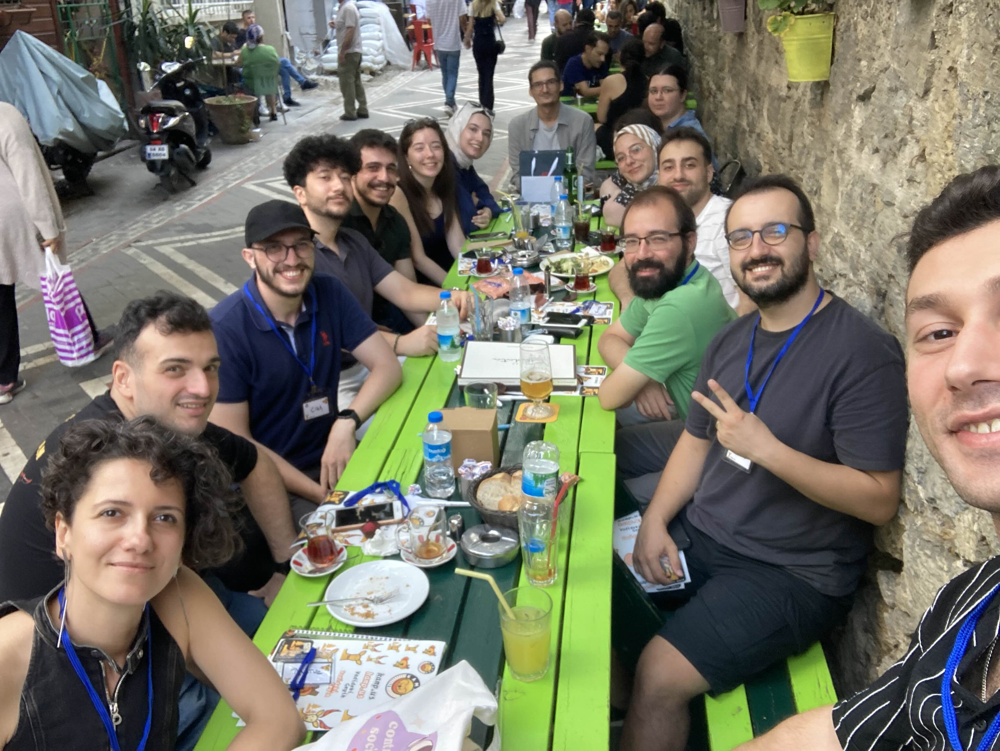

# kamp.us Bülteni / 001

*Aşağıdaki içeriğin bir bölümü yapay zekayla İngilizce’den Türkçe'ye çevrildi. Orijinal icerik icin kamp.us’te bizi bul.*

## Kampüs Buluşması: İstanbul'da Keyifli Bir Gün

Bu hafta, Kampüs Discord sunucusu üyeleri İstanbul'da bir araya geldi. Sanal ortamdan gerçek dünyaya taşınan bu buluşma, üyelerimiz için unutulmaz anılarla dolu bir gün oldu.



Fotoğraflarda gördüğümüz kadarıyla, ekip harika vakit geçirmiş! Birlikte birşeyler içip sohbet eden, ve teknoloji üzerine ateşli tartışmalar yapan üyelerimiz, online platformda kurdukları bağları yüz yüze pekiştirme fırsatı buldular.

Bu tür etkinlikler, sadece eğlenceli olmakla kalmayıp aynı zamanda networking için de mükemmel fırsatlar sunuyor. Farklı uzmanlık alanlarından gelen üyelerimizin bir araya gelmesi, yeni fikirlerin ve iş birliklerinin doğmasına zemin hazırlıyor.

Bir sonraki Kampüs buluşmasını kaçırmamak için Discord sunucumuzdaki duyuruları takip etmeyi unutmayın! Kim bilir, belki de bir sonraki buluşma sizin şehrinizde olabilir.

## Vadideki Geyik S018: Yazılım Dünyasının İçyüzü

Bu haftaki Vadideki Geyik’te bölümünde, mülakat süreçleri, kariyer gelişimi ve büyük teknoloji şirketlerinin işe alım stratejileri hakkında değerli içgörüler paylaştık.

İşte öne çıkan bazı noktalar:
1. **Mülakat Masasının İki Yüzü**: Hem mülakatı yapan hem de mülakata giren kişi perspektifinden mülakat süreçleri ele alındı. Dikkat edilmesi gereken noktalar ve yaygın hatalar paylaşıldı. 
2. **Etkili Özgeçmiş Hazırlama**: Dört Geyik, dikkat çeken bir résumé hazırlamanın inceliklerini ve farklı pozisyonlar için özgeçmişin nasıl özelleştirilebileceğini anlattık.
3. **FAANG Mülakat Stratejileri**: Büyük teknoloji şirketlerinin kendine özgü mülakat süreçleri ve beklentileri hakkında içeriden bilgiler paylaşıldı.
4. **Kariyer İlerleme Taktikleri**: Yazılım mühendisliği kariyerinde ilerlemenin yolları, sürekli öğrenme, networking ve liderlik becerilerini geliştirme konularında pratik tavsiyeler verildi.

Bu bölüm, yazılım kariyerine yeni başlayanlardan deneyimli profesyonellere kadar herkes için değerli bilgiler içeriyor.

İzlemek için adresi biliyorsun: [YouTube/vadideki-geyik](https://youtube.com/@vadideki-geyik)

Hazır gitmişken ne yapıyorsun? O kalp butonuna hunharca basıyorsun; zil ikonunu yarınlar yokmuş gibi tıklıyorsun.

## JavaScript İpuçları: URI’nin Hastasıyım, Encodingin Ustasıyım

Bu haftanın JavaScript ipucunda, URI kodlama ve kod çözmenin inceliklerini keşfediyoruz. Web geliştiricileri olarak, sıklıkla URL'lerle çalışıyoruz ve özel karakterleri nasıl ele alacağımızı anlamak, sağlam ve güvenli uygulamalar oluşturmak için çok önemlidir.

Temel yöntemlere bir göz atalım:
1. **encodeURI() ve decodeURI()**: Bu yöntemler, tüm URI'leri işlemek için mükemmeldir.
```js
const uri = 'http://kamp.us.com/archive link.html#top';
const text = encodeURI(uri);
console.logtext;
// Output: https://kamp.us.com/archive%20link.html#top
```
2. **encodeURIComponent() ve decodeURIComponent()**: Bunları, sorgu parametreleri gibi bir URI'nin parçalarını kodlamak için kullanın.
```js
const param = 'search term with spaces';
const encodedParam = encodeURIcomponent(param);
console.log('https://kamp.us/searh?q=${encodedPara}');
// Output: https://kamp.us/search%20term%20with%20spaces
```
Unutmayın, doğru URI işleme sadece işlevsellikle ilgili değildir—aynı zamanda [XSS saldırıları](https://owasp.org/www-project-top-ten/) gibi sorunları önlemeye yardımcı olan web güvenliğinin çok önemli bir yönüdür.

## Liderlik Köşesi: Ekibin Stresinden Kendini Korumak

Liderler olarak, kendimizi sıklıkla ekip üyelerimizin stresini ve zorluklarını absorbe ederken buluruz. Destekleyici olmak önemli olsa da, kendi refahımızı korumak da eşit derecede önemlidir. İşte dengeyi korumak için bazı stratejiler:

1. **Duygusal Değil, Aktif Dinleyin**: Olumsuz duyguları absorbe etmek yerine bilgi toplamaya odaklanın.
2. **Net Sınırlar Belirleyin**: Ekibinize verimli bir şekilde yardımcı olmak için belirlenmiş ofis saatleri ve grup toplantıları oluşturun.
3. **Etkilerinizi Fark Edin**: Desteğinizin ekibinizin refahı üzerindeki olumlu etkisini kabul edin.
4. **Öz Bakıma Öncelik Verin**: Unutmayın, boş bir bardaktan su dökemezsiniz. Düzenli molalar verin ve gerektiğinde destek alın.

Bu stratejileri uygulayarak, hem kendiniz hem de ekibiniz için daha sağlıklı bir çalışma ortamı yaratabilirsiniz.
## Bak Ne Bulduk

Teknoloji cephaneni geliştirecek heyecan verici yeni araçlar:

- [**AnimCubeJS**](https://animcubejs.cubing.net/animcubejs.html), Rubik Küpü'nü canlandırmak için modern bir 3D JavaScript simülatörüdür. Eğitim web siteleri için mükemmel veya sadece eğlence için
- [**llamafile**](https://github.com/Mozilla-Ocho/llamafile\)), LLM'leri tek bir dosya ile dağıtmanıza ve çalıştırmanıza olanak tanıyan yenilikçi bir araç
- [**sniffnet**](https://github.com/GyulyVGC/sniffnet), internet trafiğinizi izlemek için rahat bir yol.

Bu araçlar, modern yazılım geliştirmenin çeşitli ve yenilikçi manzarasını sergiliyor.

Bulmaca simülasyonları, yapay zeka dağıtımı veya ağ izleme ile ilgileniyorsanız, ilginizi çekecek bir şeyler var.

Meraklı kal, öğrenmeye devam et ve bir sonraki sayıya kadar, mutlu ol.

Son olarak, *don’t miss the deer, go kiss the deer.*
Yani: Doğayı koru yeşili sev geyiği öp 🦌💋.
